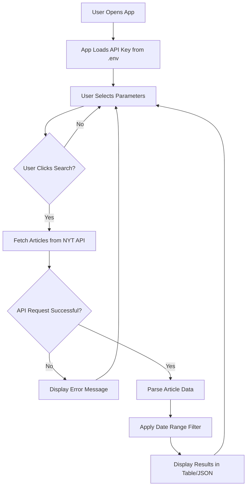

# NYT Most Popular Articles - Shiny App

## 📋 Project Overview

This Python Shiny web application provides an interactive interface for querying the New York Times Most Popular API. The app allows users to browse trending articles by selecting different popularity metrics (viewed, emailed, or shared), time periods, and date ranges. Results are displayed in a modern sidebar layout with both tabular and JSON views, making it easy to explore article metadata including titles, abstracts, publication dates, and structured facets (people, organizations, locations, topics).

---

## 🔗 API Endpoint and Parameters

### Base URL
```
https://api.nytimes.com/svc/mostpopular/v2
```

### Available Endpoints

The app supports three endpoint types:

| Endpoint | Description |
|----------|-------------|
| `viewed` | Most viewed articles |
| `emailed` | Most emailed articles |
| `shared` | Most shared articles |

### Period Options

| Period | Description |
|--------|-------------|
| `1` | Past 1 day |
| `7` | Past 7 days |
| `30` | Past 30 days |

### Request Structure

```python
url = f"{BASE_URL}/{endpoint}/{period}.json"
params = {"api-key": "YOUR_API_KEY"}
```

---

## 📊 Application Architecture

### File Structure

```
02_productivity/shiny_app/
├── app.py              # Main Shiny application (UI + server logic)
├── nyt_api.py          # API helper module (requests, parsing, error handling)
└── requirements.txt    # Python dependencies
```

### Component Overview

- **`app.py`**: Contains the Shiny UI definition and server-side reactive logic. Handles user interactions, API calls, data filtering, and rendering.
- **`nyt_api.py`**: Modular API client that handles authentication, requests, response parsing, and error handling. Adapted from the original `query_nyapi.py` script.
- **`requirements.txt`**: Lists required Python packages (shiny, pandas, requests).

---

## 🔄 Application Workflow



---

## 🚀 Usage Instructions

### Prerequisites

- Python 3.8 or higher
- New York Times API key (get one at [NYT Developer Portal](https://developer.nytimes.com/))
- `.env` file in the project root with your API key

### Setup

1. **Install Dependencies**

   Navigate to the `shiny_app` directory and install required packages:

   ```bash
   cd 02_productivity/shiny_app
   pip install -r requirements.txt
   ```

2. **Configure API Key**

   Create a `.env` file in the project root directory (same level as `query_nyapi.py`):

   ```bash
   TEST_API_KEY=your_nyt_api_key_here
   ```

   The app automatically loads this key when it starts.

### Running the Application

Start the Shiny app using one of these methods:

```bash
# Method 1: Using python -m shiny
cd 02_productivity/shiny_app
python -m shiny run app.py

# Method 2: Using shiny command (if available)
shiny run app.py
```

The app will start a local web server, typically at `http://127.0.0.1:8000`. Open this URL in your web browser to access the application.

### Using the Interface

1. **Select Article Type**: Choose from "Most Viewed", "Most Emailed", or "Most Shared" using the dropdown in the sidebar.

2. **Choose Time Period**: Select how far back to look (1, 7, or 30 days).

3. **Set Article Count**: Use the slider to specify how many articles to fetch (1-20).

4. **Filter by Date Range**: Optionally narrow results to a specific date window using the date range picker.

5. **Click Search**: Press the "Search" button to fetch articles from the NYT API.

6. **View Results**: 
   - **Articles Table tab**: Browse results in a formatted data table with columns for title, date, section, abstract, people, and URL.
   - **JSON View tab**: Expand individual articles to see the complete raw JSON data including all facets.

---

## 📊 Data Structure

### Article Object

Each article returned by the API contains the following fields:

```json
{
  "title": "Article Title",
  "published_date": "2026-02-08",
  "section": "Technology",
  "url": "https://www.nytimes.com/...",
  "abstract": "Article summary text...",
  "des_facet": "Topic1, Topic2",
  "org_facet": "Organization1, Organization2",
  "per_facet": "Person1, Person2",
  "geo_facet": "Location1, Location2",
  "des_facet_list": ["Topic1", "Topic2"],
  "org_facet_list": ["Organization1", "Organization2"],
  "per_facet_list": ["Person1", "Person2"],
  "geo_facet_list": ["Location1", "Location2"]
}
```

### Facet Fields

- **`des_facet`**: Descriptors/topics (string and list versions)
- **`org_facet`**: Organizations mentioned (string and list versions)
- **`per_facet`**: People mentioned (normalized from "Last, First" to "First Last" format)
- **`geo_facet`**: Geographic locations (string and list versions)

---

## ⚠️ Error Handling

The app includes comprehensive error handling for common issues:

| Error Type | User-Friendly Message |
|------------|----------------------|
| Missing API Key | "API key not found. Please add TEST_API_KEY to your .env file." |
| Invalid API Key | "Invalid API key. Please check your TEST_API_KEY in the .env file." |
| Network Error | "Network error: Could not connect to the NYT API. Check your internet connection." |
| Rate Limit | "Rate limit exceeded. Please wait a moment and try again." |
| Empty Results | "The API returned no articles for the selected parameters." |
| Timeout | "Request timed out. The NYT API is not responding. Please try again." |

All errors are displayed in a red alert box below the Search button.

---

## 🔧 Technical Details

### Key Features

- **Reactive Programming**: Uses Shiny's reactive framework for automatic UI updates when data changes.
- **Client-Side Filtering**: Date range filtering happens after API fetch, allowing flexible date windows within the API's period constraints.
- **Modular Design**: API logic separated into `nyt_api.py` for easy testing and maintenance.
- **Name Normalization**: Person names are automatically converted from "Last, First" format to "First Last" for better readability.
- **Dual View Modes**: Switch between formatted table view and raw JSON inspection.

### Dependencies

```python
shiny>=1.0.0      # Web framework for Python
pandas>=1.5.0     # Data manipulation and table display
requests>=2.28.0  # HTTP library for API calls
```

---

## 📝 Notes

- The NYT API only supports fixed time periods (1, 7, or 30 days), so the date range filter works on the client side after fetching results.
- The app loads the API key from the project root `.env` file automatically—no need to enter it manually in the UI.
- Person name normalization (e.g., "Smith, John" → "John Smith") is handled automatically for better readability.
- The app preserves all original facet data in list format for the JSON view, while displaying comma-separated strings in the table view.

---

## 🔗 Additional Resources

- [New York Times API Documentation](https://developer.nytimes.com/docs/most-popular-product/1/overview)
- [NYT Developer Portal](https://developer.nytimes.com/)
- [Shiny for Python Documentation](https://shiny.rstudio.com/py/)
- [Python `requests` Library Documentation](https://requests.readthedocs.io/)
- [Pandas Documentation](https://pandas.pydata.org/docs/)

---

## 📁 Related Files

- Original API query script: [`query_nyapi.py`](../../query_nyapi.py)
- Lab exercise: [`LAB_cursor_shiny_app.md`](LAB_cursor_shiny_app.md)

