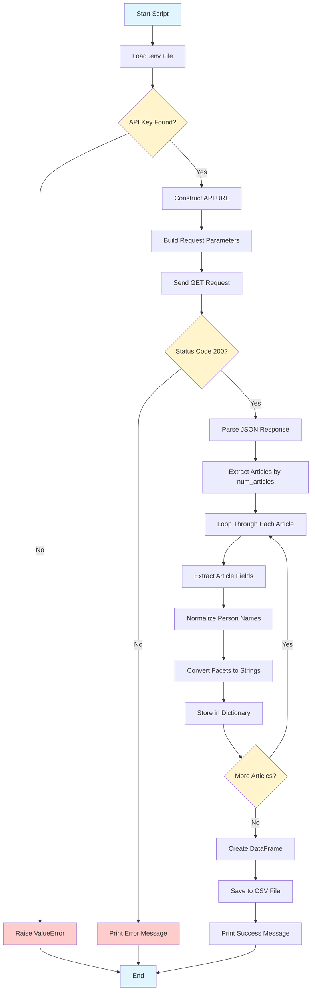

# New York Times Most Popular Articles Query
# HELLO
## 📋 Project Overview

This Python script queries the **New York Times Most Popular API** to retrieve the most viewed articles from the past day. It extracts structured metadata including people, organizations, locations, and topics, then normalizes person names and saves the data to CSV format. This script is designed as a foundation for building a Facet-Aware Retrieval-Augmented Generation (RAG) system to analyze political discourse and trends.

---

## 🔗 API Endpoint and Parameters

### Base URL
```
https://api.nytimes.com/svc/mostpopular/v2
```

### Endpoint
```
GET /viewed/{period}.json
```

### Parameters

| Parameter | Type | Required | Description |
|-----------|------|----------|-------------|
| `api-key` | string | Yes | Your New York Times API key (stored in `.env` as `TEST_API_KEY`) |
| `period` | integer | Yes | Time period for most popular articles:<br>• `1` = Last day<br>• `7` = Last 7 days<br>• `30` = Last 30 days |

**Current Script Configuration:**
- Period: `1` (last day)
- Full endpoint: `/viewed/1.json`
- Default articles retrieved: 20 (configurable via `num_articles` parameter)

---

## 📊 Request and Response Data Structure

### Request Structure

The script sends a `GET` request with the following structure:

```python
url = "https://api.nytimes.com/svc/mostpopular/v2/viewed/1.json"
params = {"api-key": "YOUR_API_KEY"}
```

### Response Structure

The API returns a JSON object with the following structure:

```json
{
  "status": "OK",
  "copyright": "Copyright (c) 2026 The New York Times Company...",
  "num_results": 20,
  "results": [
    {
      "uri": "nyt://article/...",
      "url": "https://www.nytimes.com/...",
      "id": 10000000,
      "asset_id": 10000000,
      "source": "New York Times",
      "published_date": "2026-02-07",
      "updated": "2026-02-07 10:30:00",
      "section": "U.S.",
      "subsection": "Politics",
      "nytdsection": "u.s.",
      "adx_keywords": "...",
      "column": null,
      "byline": "By Author Name",
      "type": "Article",
      "title": "Article Title",
      "abstract": "Article summary or abstract text...",
      "des_facet": ["Topic1", "Topic2"],
      "org_facet": ["Organization1"],
      "per_facet": ["Last, First Middle"],
      "geo_facet": ["Location1"],
      "media": [...],
      "eta_id": 0
    },
    ...
  ]
}
```

### Key Response Fields

| Field | Type | Description |
|-------|------|-------------|
| `status` | string | Response status (typically "OK") |
| `num_results` | integer | Total number of articles returned |
| `results` | array | Array of article objects |
| `results[].title` | string | Article headline |
| `results[].published_date` | string | Publication date (YYYY-MM-DD) |
| `results[].abstract` | string | Article summary/abstract |
| `results[].section` | string | Article section (e.g., "U.S.", "Technology") |
| `results[].url` | string | Full article URL |
| `results[].des_facet` | array | Descriptor/topic tags |
| `results[].org_facet` | array | Organization names mentioned |
| `results[].per_facet` | array | Person names (format: "Last, First") |
| `results[].geo_facet` | array | Geographic locations |

### Data Processing

The script performs the following transformations:

1. **Person Name Normalization**: Converts person names from `"Last, First Middle"` format to `"First Middle Last"` format
   - Example: `"Trump, Donald J"` → `"Donald J Trump"`
   - Example: `"Obama, Barack"` → `"Barack Obama"`

2. **Data Export**: Saves articles to CSV with:
   - Facet lists converted to comma-separated strings for CSV compatibility
   - Timestamped filenames (e.g., `nyt_articles_20260208_114113.csv`)

---

## 🔄 API Workflow Diagram



---

## 🚀 Usage Instructions

### Prerequisites

1. **Python 3.6+** installed on your system
2. **New York Times API Key** - Get one free at [NYT Developer Portal](https://developer.nytimes.com/)
3. **Required Python packages**: `requests`, `pandas`

### Required Dependencies

Install the required packages:

```bash
pip install requests pandas
```

Or add to a `requirements.txt` file:

```
requests
pandas
```

Then install with:

```bash
pip install -r requirements.txt
```

### Setup Steps

1. **Create a `.env` file** in the project root directory (same folder as `query_nyapi.py`)

2. **Add your API key** to the `.env` file:
   ```
   TEST_API_KEY=your_api_key_here
   ```
   Replace `your_api_key_here` with your actual New York Times API key.

3. **Verify the `.env` file** is in the same directory as the script:
   ```
   project/
   ├── query_nyapi.py
   └── .env
   ```

### Running the Script

From the command line, navigate to the project directory and run:

```bash
python query_nyapi.py
```

Or on some systems:

```bash
python3 query_nyapi.py
```

### Customizing the Number of Articles

To retrieve a different number of articles, modify the `main()` function in `query_nyapi.py`:

```python
def main():
    query_nyt_api(num_articles=10)  # Change 10 to desired number
```

Or call the function directly:

```python
query_nyt_api(num_articles=5)  # Retrieve 5 articles
```

### Expected Output

The script will:
1. Display article information in the console:
   ```
   1. Article Title (2026-02-07) | U.S.
      Descriptors: Topic1, Topic2
      People: Donald J Trump, Barack Obama
      Organizations: Organization1
      Locations: Location1
      Abstract: Article summary...
      URL: https://www.nytimes.com/...
   ```

2. Save data to a CSV file with timestamp:
   ```
   ✅ Saved 20 articles to nyt_articles_20260208_114113.csv
   ```

### Output File Structure

The CSV file contains the following columns:
- `title` - Article headline
- `published_date` - Publication date
- `section` - Article section
- `url` - Article URL
- `abstract` - Article abstract
- `des_facet` - Descriptors (comma-separated)
- `org_facet` - Organizations (comma-separated)
- `per_facet` - People (normalized, comma-separated)
- `geo_facet` - Locations (comma-separated)

---

## ⚠️ Troubleshooting

**Error: "TEST_API_KEY not found in .env file"**
- Ensure the `.env` file exists in the same directory as the script
- Verify the file contains: `TEST_API_KEY=your_actual_key`
- Check that there are no extra spaces around the `=` sign

**Error: HTTP Status Code 401 (Unauthorized)**
- Your API key may be invalid or expired
- Verify your API key is correct in the `.env` file
- Check your API key status at the NYT Developer Portal

**Error: HTTP Status Code 429 (Too Many Requests)**
- You've exceeded the API rate limit
- Wait a few minutes and try again
- Free tier has rate limits; consider upgrading if needed

**Error: "ModuleNotFoundError: No module named 'pandas'"**
- Install missing dependencies: `pip install pandas requests`

**No output or empty results**
- Check your internet connection
- Verify the API endpoint is accessible
- The API may be temporarily unavailable

---

## 📝 Notes

- The script uses a custom `.env` loader function instead of external packages like `python-dotenv`
- Person names are automatically normalized from "Last, First" to "First Last" format
- CSV files are saved with timestamps to prevent overwriting previous exports
- The script handles basic error cases but could be extended with more robust error handling
- Free NYT API keys have rate limits; be mindful of request frequency
- The script is designed as a foundation for a Facet-Aware RAG system for political discourse analysis

---

## 🔗 Additional Resources

- [New York Times API Documentation](https://developer.nytimes.com/docs/most-popular-product/1/overview)
- [NYT Developer Portal](https://developer.nytimes.com/)
- [Python `requests` Library Documentation](https://requests.readthedocs.io/)
- [Pandas Documentation](https://pandas.pydata.org/docs/)
